# 📱 İş ve Personel Yönetim Sistemi

Flutter ile geliştirilmiş kapsamlı iş, personel ve tahsilat takip uygulaması.

## 🎯 Proje Hakkında

Kendi işletmemiz için geliştirdiğim bu uygulama, günlük operasyonları dijitalleştirmek 
ve iş süreçlerini optimize etmek amacıyla tasarlanmıştır. Gerçek iş ihtiyaçlarından 
yola çıkılarak geliştirilmiş ve aktif olarak kullanılmaktadır.

## ✨ Özellikler

### 👥 Personel Yönetimi
- Personel ekleme, düzenleme ve silme
- Rol yönetimi (Yönetici/Personel)
- İletişim bilgileri yönetimi
- Maaş ve çalışma süresi takibi
- Aktif/Pasif durum kontrolü
- Personel başına iş istatistikleri
- Atanan işlerin takibi

### 💼 İş Yönetimi
- Detaylı iş kartları oluşturma
- Müşteri bilgileri ve iletişim
- Konum ve adres bilgisi
- Durum yönetimi (Beklemede/Devam Ediyor/Tamamlandı)
- Çoklu personel atama sistemi
- Tarih ve zaman takibi
- Gelişmiş arama ve filtreleme
- İş başlığı ve açıklama alanları

### 💰 Tahsilat Yönetimi
- Otomatik tutar hesaplama
- Toplam/Ödenen/Kalan gösterimi
- Detaylı ödeme geçmişi
- Ödeme yöntemi kaydı (Nakit/EFT/Kredi Kartı)
- Tarih ve saat damgası
- Kısmi ödeme desteği
- Ödeme yapan kişi bilgisi

### 🔐 Kullanıcı Yönetimi
- Rol tabanlı yetkilendirme
- Güvenli kimlik doğrulama
- Kullanıcı profili yönetimi
- Admin paneli

## 🛠️ Kullanılan Teknolojiler

- **Flutter** - Cross-platform mobil uygulama framework
- **Dart** - Programlama dili
- **Firebase Firestore** - Cloud veritabanı
- **Firebase Authentication** - Kullanıcı yönetimi
- **BLOC Pattern** - State management
- **Material Design 3** - Modern UI/UX

## 📱 Ekran Görüntüleri

### Ana Sayfa
Dashboard ile günlük iş özeti, hızlı istatistikler ve bekleyen işlerin görüntülenmesi.

  
  

---

### İş Takibi
Gelişmiş filtreleme, arama özellikleri, yeni iş ekleme ve durum güncelleme.

  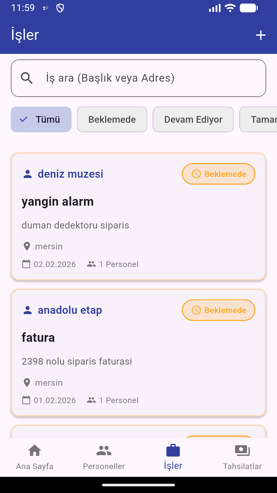
  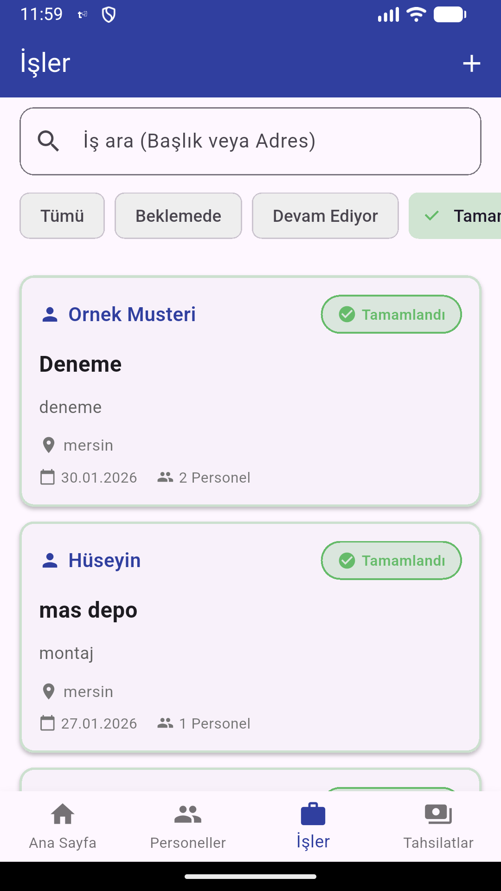
  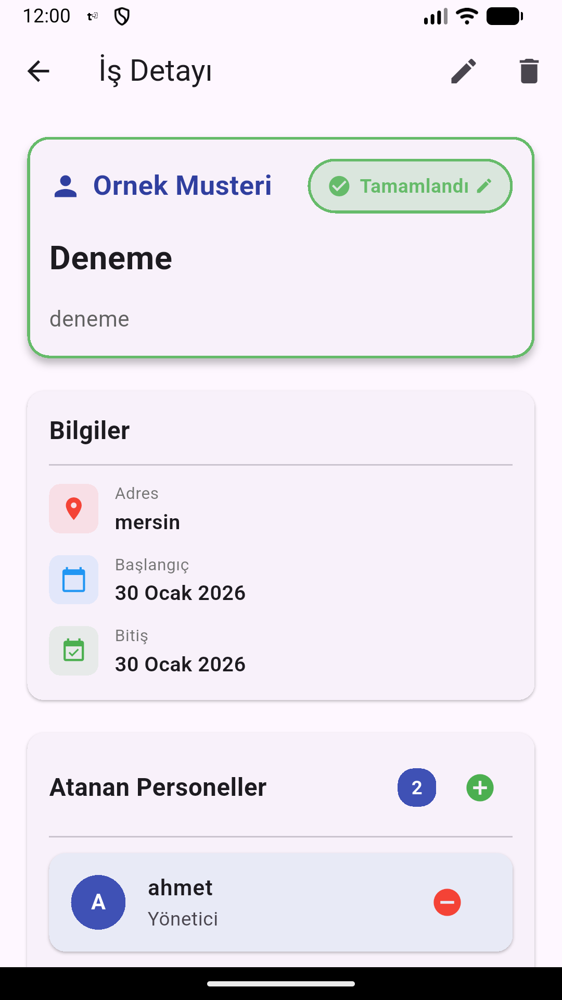

  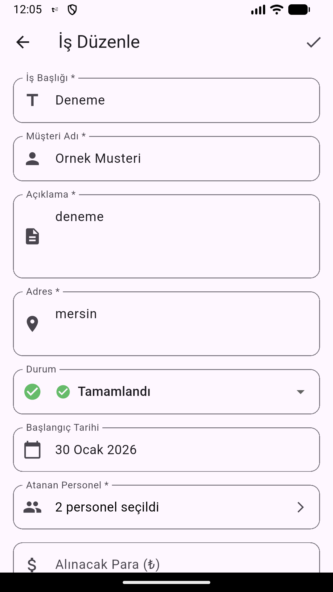
  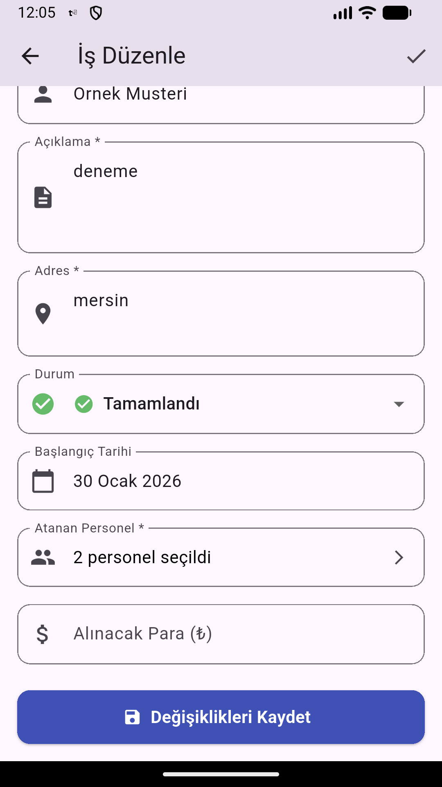
  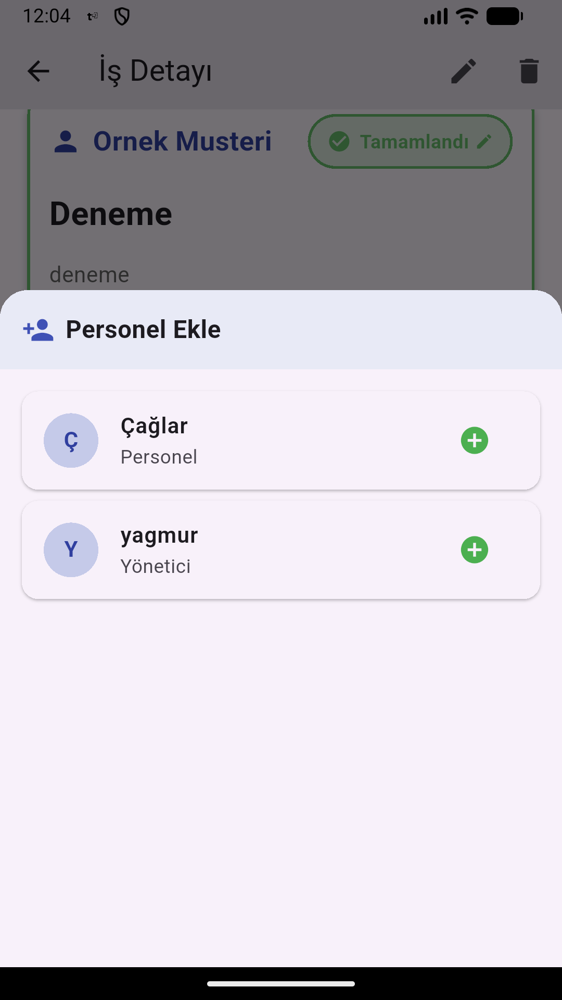

  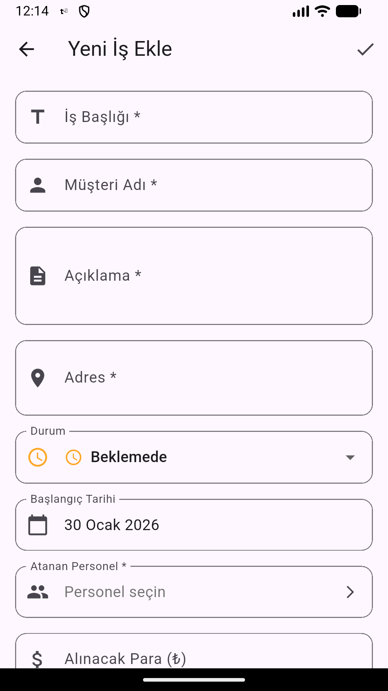
  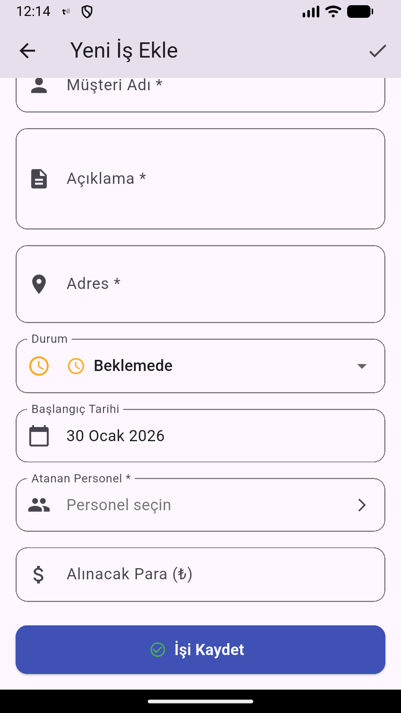

---

### Personel Yönetimi
Personel listesi, detay görünümleri, düzenleme formları ve iş atamaları.

  
  
  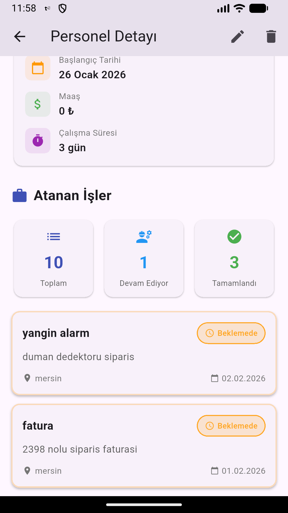

  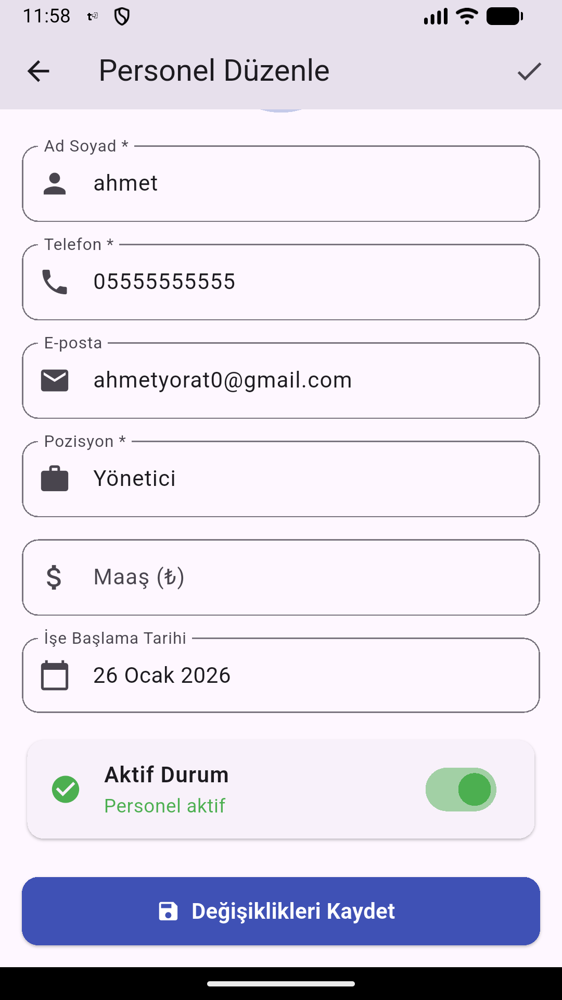

---

### Tahsilat Takibi
Ödeme takibi, detaylı geçmiş kayıtlar ve finansal raporlar.

  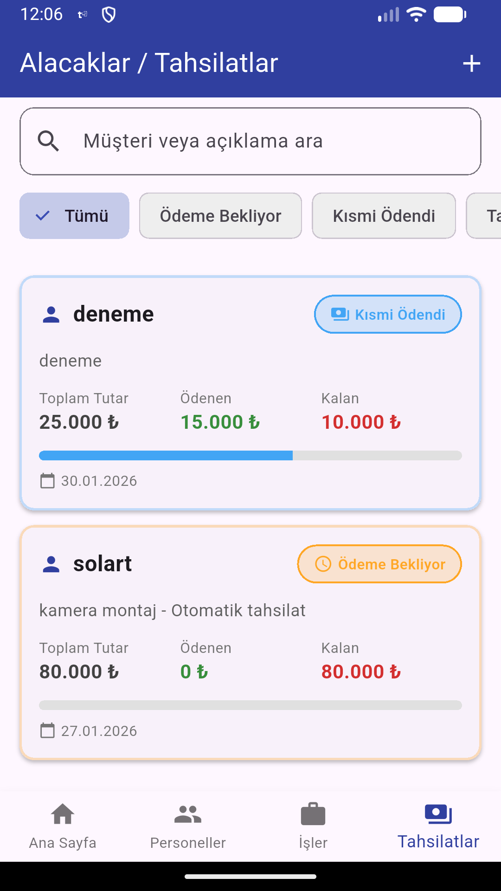
  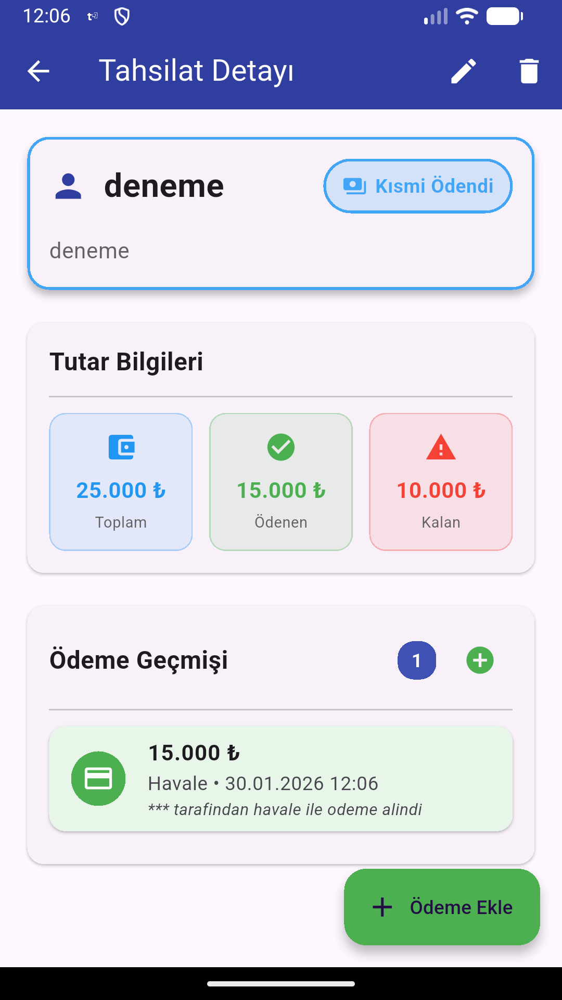

  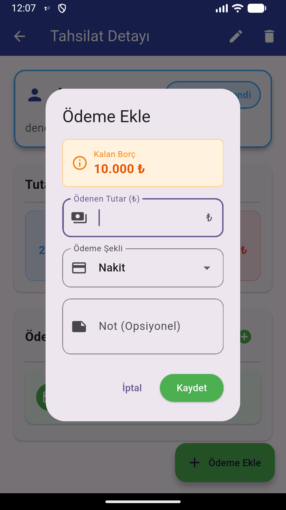
  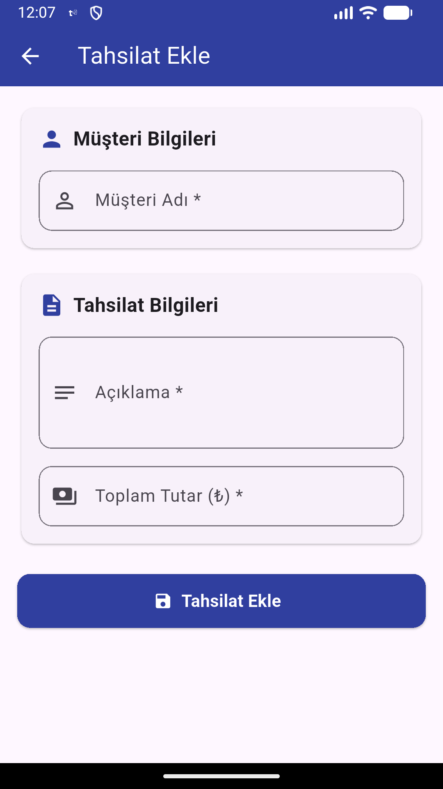

## 💻 Geliştirme Süreci

Bu proje modern AI-assisted development metodolojisi kullanılarak geliştirilmiştir:

- ✅ İhtiyaç analizi ve sistem tasarımı manuel olarak yapıldı
- ✅ Flutter temelleri Bootcamp eğitimiyle öğrenildi
- ✅ Karmaşık özellikler için AI araçları (ChatGPT/Claude) danışman olarak kullanıldı
- ✅ Tüm kod anlaşılarak entegre edildi ve kapsamlı testlerden geçirildi
- ✅ Gerçek dünya kullanımıyla iteratif olarak geliştirildi ve optimize edildi

## 🎓 Öğrendiklerim

- **Complex State Management** - Çoklu veri modeli ve ilişkileri yönetme
- **CRUD Operations** - Tüm varlıklar üzerinde eksiksiz CRUD işlemleri
- **Role-Based Access Control** - Rol tabanlı yetkilendirme sistemleri
- **Advanced Search & Filter** - Performanslı veri filtreleme algoritmaları
- **Date & Time Management** - Tarih ve zaman işlemleri
- **Multi-Select UI Patterns** - Kullanıcı dostu çoklu seçim mekanizmaları
- **Payment Tracking Logic** - Finansal hesaplama ve takip sistemleri
- **Real-World Problem Solving** - İş ihtiyaçlarını teknik çözümlere dönüştürme
- **Firebase Integration** - Cloud veritabanı entegrasyonu ve yönetimi
- **Modern Development Tools** - AI destekli geliştirme süreçleri

## 🎯 Gelecek Planlar

- [ ] Grafik ve raporlama modülü
- [ ] Push notification entegrasyonu
- [ ] PDF export özelliği
- [ ] İş fotoğrafı ekleme
- [ ] Offline mod desteği
- [ ] Çoklu dil desteği
- [ ] Gelişmiş analitik ve dashboard

## 📧 İletişim

**Ahmet Derviş Yorat**
- Email: ahmetyorat0@gmail.com
- LinkedIn: [[Profil Linki]](https://www.linkedin.com/in/ahmetyorat/)
- GitHub: [@AhmetYorat](https://github.com/AhmetYorat)

---

**Proje Tarihi:** Ocak 2025  
**Durum:** Aktif Kullanımda 🟢  
**Lisans:** MIT
